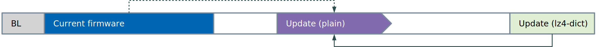
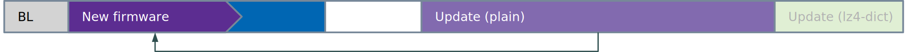
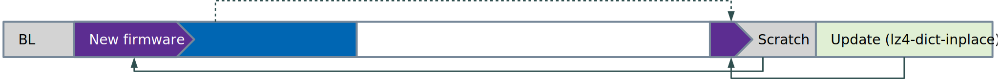

# Firmware Update Types

## Update Process

Initially, only the bootloader and the original firmware reside in
the device Flash memory. Generally, the bootloader is located at the
very beginning, followed by the current firmware. The bootloader
component is static and does not change, nor is it updatable itself.

It is the application's responsility to place an available update
somewhere in Flash memory, preferrably at the very end to maximize
the available space for updating. Updating overwrites the current
firmware, leaving only the new firmware in Flash memory.

As the update process is destructive, extreme care is taken to make
this step robust. It is implemented in such a way that in case of
interruption, the update can be restarted or resumed. This ensures
that even in the case of power-loss or other transient failure, the
bootloader can continue updating on the next pass, leaving the device
with a functioning firmware.

The bootloader supports a number of different update types:

- Plain Updates
- LZ4 Compressed Updates
- LZ4 Delta Updates
- LZ4 In-Place Delta Updates

### Plain Updates (`plain`)

Plain updates are the most simple way to perform an update. The full
new firmware image is contained as-is in the update blob.

The bootloader then simply copies the firmware from the update blob
to its intended location.

After the process is complete, the new firmware is in place and the
update can be invalidated.

### LZ4 Compressed Updates (`lz4`)

LZ4 compressed updates differ from plain updates only by using [LZ4
compression](https://en.wikipedia.org/wiki/LZ4_(compression_algorithm))
to reduce the size of the update. LZ4 was chosen because of the
simplicity and robustness of the decompressor.

The bootloader then decompresses the firmware from the update blob
to its intended location.

After the process is complete, the new firmware is in place and the
update can be invalidated.

### LZ4 Delta Updates (`lz4-dict`)

:wastebasket: *Deprecated*

LZ4 delta updates make use of _dictionary mode_, whereby data can be
preloaded into the backreferences space. For delta updates, the
previous firmware image is used as the dictionary. This can dramatically
reduce the size of an update, but since decompression requires access
to the dictionary, the update is now specific to the source firmware
it was created for. Further, the entire dictionary must stay available
during the decompression process, which means the original firmware
cannot be decompressed directly to the intended location.

LZ4 delta updates are therefore encoded as plain udpates before the
compression step. The bootloader then decompresses this plain update
blob into free Flash memory between the compressed update and the
current firmware, while using the current firmware as dictionary.

Once the decompression is complete, the plain update is available
in Flash and the compressed update can be invalidated.

The process then continues by using the plain update as above.

After the process is complete, the new firmware is in place and the
update can be invalidated.

As can be seen, while LZ4 delta updates are quite small and can thus
be transmitted very efficiently over-the-air, the two-step decompression
method uses much more Flash memory than any of the other methods.

### LZ4 In-Place Delta Updates (`lz4-dict-inplace`)

By carefully coding the update and making use of a temporary scratch
buffer, the delta update can be extracted directly to its final location
in Flash memory. This dramatically reduces the amount of free space
necessary on the device. The scratch buffer's size can be variable,
thereby allowing the trading of compression efficiency against Flash
memory requirements.

The new firmware is uncompressed one block at a time into a temporary
scratch buffer, before it is copied to its final location. The update
blob contains itegrity protection data for each block to allow transactional
execution of this update method.

While not the entire previous firmware is available as a dictionary
for every block with this method, it still yields compression efficiency
comparable to regular delta updates in practice.

After the process is complete, the new firmware is in place and the
update can be invalidated.

